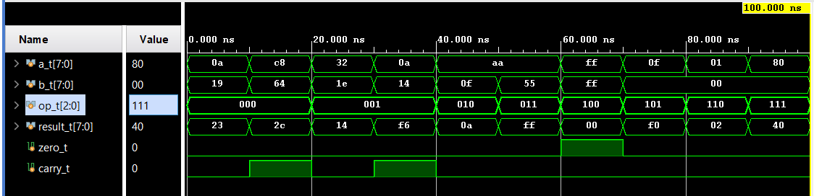

# ALU + Datapath in SystemVerilog

Proiect CID (Circuite Integrate Digitale, ETTI UPB) — ALU pe 8 biti conectata cu ROM, RAM si register file. Simulata in Vivado.

## Module

| Fisier | Rol |
|---|---|
| `src/alu.sv` | ALU 8 biti, 8 operatii (combinational) |
| `src/register_file.sv` | 4 registri pe 8 biti |
| `src/rom.sv` | ROM 8x8 cu operand-uri |
| `src/ram.sv` | RAM 8x8 sincron |
| `src/datapath.sv` | Top-level |
| `sim/alu_tb.sv` | Testbench ALU |
| `sim/datapath_tb.sv` | Testbench datapath |

## Operatii ALU

| `op` | Operatie |
|---|---|
| `000` | ADD |
| `001` | SUB |
| `010` | AND |
| `011` | OR |
| `100` | XOR |
| `101` | NOT |
| `110` | SHL |
| `111` | SHR |

## Simulare in Vivado

1. Create New Project -> RTL Project, fara surse
2. Add Sources -> design sources -> `src/`
3. Add Sources -> simulation sources -> `sim/`
4. Set `alu_tb` ca top de simulare
5. Run Simulation -> Run Behavioral Simulation
6. Verifica semnalele in waveform

## Waveform - Datapath complet

Secventa: ADD 10+10=0x14, ADD 10+25=0x23, SUB 200-100=0x64, AND 0xAA&0x0F=0x0A, XOR 0xFF^0xFF=0x00 (zero flag = 1).

## Waveform - ALU testat izolat

Toate cele 8 operatii ale ALU: ADD (`000`), SUB (`001`), AND (`010`), OR (`011`), XOR (`100`), NOT (`101`), SHL (`110`), SHR (`111`).
